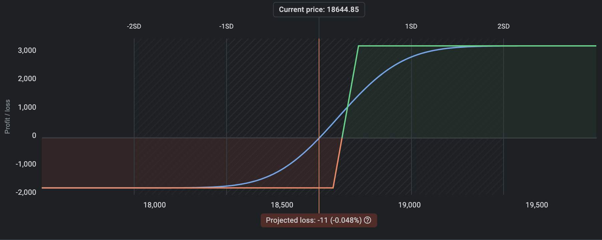

---
tags:
  - bullish
  - volatile
  - non-volatile
  - month-start
---

import AttributeCard from "@site/src/components/AttributeCard";
import AttributeGrid from "@site/src/components/AttributeGrid";
import Leg from "@site/src/components/Leg";

# Bull Call Spread

## Features

<AttributeGrid>
  <AttributeCard title="View" icon="visibility" color="info">
    Moderately Bullish
  </AttributeCard>
  <AttributeCard title="Premium" icon="currency_exchange" color="info">
    Net Debit
  </AttributeCard>
  <AttributeCard title="Margin" icon="currency_rupee" color="info">
    50000
  </AttributeCard>
  <AttributeCard title="POP" icon="percent" color="success">
    80%
  </AttributeCard>
  <AttributeCard title="Max Loss" icon="dangerous" color="warning">
    Net premium
  </AttributeCard>
  <AttributeCard title="Profit" icon="payments" color="info">
    Limited
  </AttributeCard>
</AttributeGrid>

## Legs

<Leg side="PE"  transaction="S" moneyNess="OTM" lotSize={1} moreInfo="Max OI"/>
<Leg side="CE"  transaction="B" moneyNess="ATM" lotSize={1} moreInfo="Max OI"/>
<Leg side="PE"  transaction="S" moneyNess="ITM" lotSize={2} moreInfo="Max OI"/>
<Leg side="CE"  transaction="B" moneyNess="OTM" lotSize={1} moreInfo="Max OI"/>

## Example
